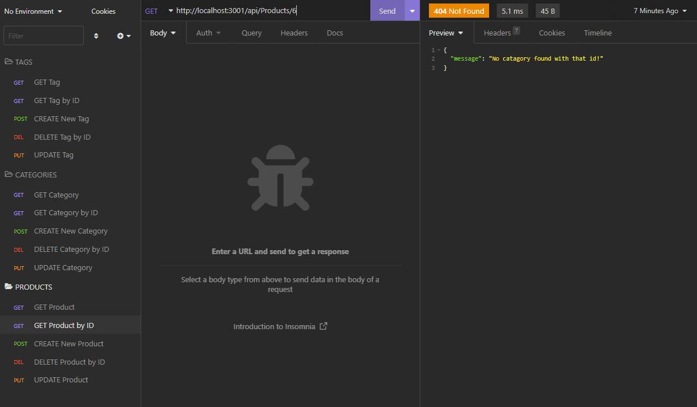

# Team Webpage Generator

## Description
This program allows you to send requests to a server and edit the database with those requests.

## Installation
[Demonstration Video](https://drive.google.com/file/d/1nxBUqqWE9pgTxIKq-lUHv1zqe19qMfrT/view)

## Usage
[Demonstration Video](https://drive.google.com/file/d/1nxBUqqWE9pgTxIKq-lUHv1zqe19qMfrT/view)

## Credits
Jaymen Laton
[Github Repo](https://github.com/CanadianMRE/sequelize-demo)

## License
None

## Questions
Visit my github at [CanadianMRE](https://github.com/CanadianMRE)
or
Contact me through email at jaymen100@gmail.com
